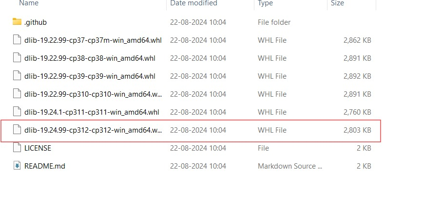

# Raksha Alert : Intruder detector

Raksha Alert is a powerful Flask-based web application designed for real-time security monitoring through face recognition, emotion detection, voice recognition, and object detection. Utilizing advanced technologies like Python, Flask, OpenCV, and DeepFace, this system provides an extra layer of protection for homes, offices, and other secure locations by detecting known and unknown individuals, hazardous objects, and potential threats.

## Features

- **Real-Time Face Recognition**: Captures live video from a webcam, identifies known individuals, and detects unknown faces in real time.
- **Emotion Detection**: Analyzes the detected faces to identify emotions, providing context to the detected events.
- **Voice Recognition** for Danger Alerts: Recognizes voice commands or distress signals from known individuals and triggers alerts when danger is detected.
- **Hazardous Object Detection**: Identifies dangerous objects like knives, scissors, or other hazardous items, enhancing safety measures.
- **Email Alerts with Geolocation**: Sends instant alerts via email with attached images and geolocation details when an unknown face is detected.

- **RakshaBot – Your Project Guide**: An integrated chatbot that provides users with detailed information about the project, its features, and usage instructions. RakshaBot serves as an interactive guide, answering questions about the system’s capabilities, how to set it up, and troubleshooting tips, making it easy for users to navigate and utilize the application efficiently.

## Preview

### Screenshot

 <!-- Replace with the correct path to your image -->

### Video Demo

 <!-- Replace with the correct path to your GIF -->

## Technologies Used

- **Python**: For programming.
- **Flask**: Backend web framework to serve the application.
- **OpenCV**: For capturing and processing webcam images.
- **SMTP**: For sending email alerts with unknown face images and geolocation.
- **pygame**: For alarming purpose.
- **OpenAI**: For using GPT model.
- **Boto3**: For AWS SDK service.
- **Cloud**: For SNS functionality.
- **BeautifulSoup4**: For web scrapping.
- **Speech Recognition**: For voice recognition.

## Pre-trained models
- **Face Recognition**: Library for recognizing faces.
- **DeepFace**: For detecting emotions from facial expressions.
- **YOLOv4**: For Object detection.
- **Geocoder**: For fetching geolocation information based on the user's IP address.

## Prerequisites

Ensure you have the following installed on your system:

- Python 3.7 or higher
- pip (Python package installer)

## Installation

Follow these steps to set up the project locally:

1. **Clone the repository:**

   ```bash
   git clone https://github.com/your-username/your-repository-name.git
   cd your-repository-name

2. **Install the required packages:**

   ```bash
   pip install -r requirements.txt

   - Alternatively, you can install the dependencies manually:

   pip install flask opencv-python face_recognition deepface geocoder

3. **Prepare known faces:**

    ```bash

    - Place images of known individuals in the known directory. The filename should be the person's name (e.g., john_doe.jpg).

4. **Set up email credentials:**

    ```bash

    - Edit the app.py file and replace the placeholders for smtp_user, smtp_password, and recipient_email with your own email credentials and the recipient's email address.

5. **Run the application:**

    ```bash

    python app.py

6. **Access the application:**

    ```bash

    - Open your web browser and go to http://127.0.0.1:5000 to view the live video feed.

## Directory Structure

    your-repository-name/
    │
    ├── known/                     # Directory for known faces images
    │   └── john_doe.jpg           # Example image of a known person
    │
    ├── unknown/                   # Directory where unknown faces images are saved
    │
    ├── templates/
    │   └── index.html             # HTML template for the web application
    │
    ├── images/                    # Folder for README images and video files
    │   ├── screenshot.png         # Screenshot of the application
    │   └── demo.gif               # GIF of the application in action
    │
    ├── app.py                     # Main Flask application file
    │
    ├── requirements.txt           # Required Python packages
    │
    └── README.md                  # Project README file


## Configuration
- Camera: The application uses the default webcam (cv2.VideoCapture(0)). You can change the source by modifying the index (e.g., cv2.VideoCapture(1) for another camera).
- Frame Rate: Adjust the frame rate in the generate_frames function if performance is an issue.
- Email: Ensure your email provider allows SMTP access (you may need to enable less secure app access).

## Troubleshooting
- Camera Not Accessible: Ensure no other application is using the camera.
- Slow Performance: Reduce the frame rate or adjust the emotion detection settings.
- SMTP Errors: Double-check email credentials and ensure less secure app access is enabled.

## License
- This project is licensed under the MIT License. See the LICENSE file for details.

## Contributing
- Contributions are welcome! Please fork the repository and create a pull request with your changes.

## Acknowledgements
- Flask
- OpenCV
- Face Recognition
- DeepFace
- Geocoder
- YOLOv4 

Download 

1. yolov4.cfg - https://github.com/AlexeyAB/darknet/blob/master/cfg/yolov4.cfg
2. coco.names - https://github.com/AlexeyAB/darknet/blob/master/cfg/coco.names
3. yolov4.weights - https://github.com/AlexeyAB/darknet/tree/master?tab=readme-ov-file#datasets


## How to install cmake and dlib?

1. Download visual studio c++ community 2022

https://visualstudio.microsoft.com/downloads/

Download community.


2. Tick Desktop development with c++

 

3. Download cmake from google.


**Install dlib**

- Go to this link - https://github.com/z-mahmud22/Dlib_Windows_Python3.x

- Download zip file and extract it from github


- Copy the file from extracted folder according to your python version installed in your env.



Above file is for python version 3.12

- paste the file outside of the dlib folder

- install that file

 `pip install pathofthefile\filefullname.whl`

 

- Install face_recognition

 `pip install face_recognition`

---

### Keywords

`#FaceRecognition` `#EmotionDetection` `#VoiceRecognition` `#ObjectDetection` `#FlaskWebApp` `#RealTimeMonitoring` `#Security`
`#RakshaAlert` `#IntruderDetection` `#Python` `#Flask` `#OpenCV` `#DeepFace` `#RealTimeSecurity` `#HomeSecurity` `#SurveillanceSystem` `#SecurityMonitoring` `#AI` `#MachineLearning`


